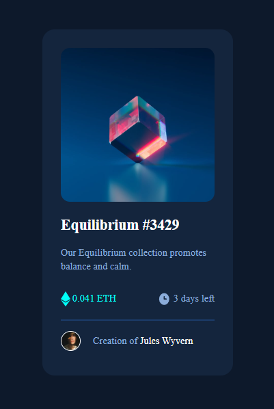

# BLOCKCHAIN UNN - NFT preview card component solution

This is a solution to the NFT preview card component challenge for BUD session 4

## Overview

### The challenge

Users should be able to:

- View the optimal layout depending on their device's screen size

### Screenshot

### Links

- Solution URL: [Add solution URL here](http://127.0.0.1:5500/index.html)
- Live Site URL: [Add live site URL here](https://my-nftcard.netlify.app/)

## My process
I began the project by laying my html structure to give in the necessary details. Afterwards, i outlined the css styles to be used then worked on each section one after the other.

### Built with

- Semantic HTML5 markup
- CSS custom properties
- Flexbox
- CSS Grid
- Mobile-first workflow

### What I learned

After the completion of the project, amidst the css syntaxes known to me, i learn using the hsl method of coloring and also i was able to use auto margin when i centered the NFT card

## Acknowledgments

Thank you BLOCKCHAIN UNN for this opportunity. 